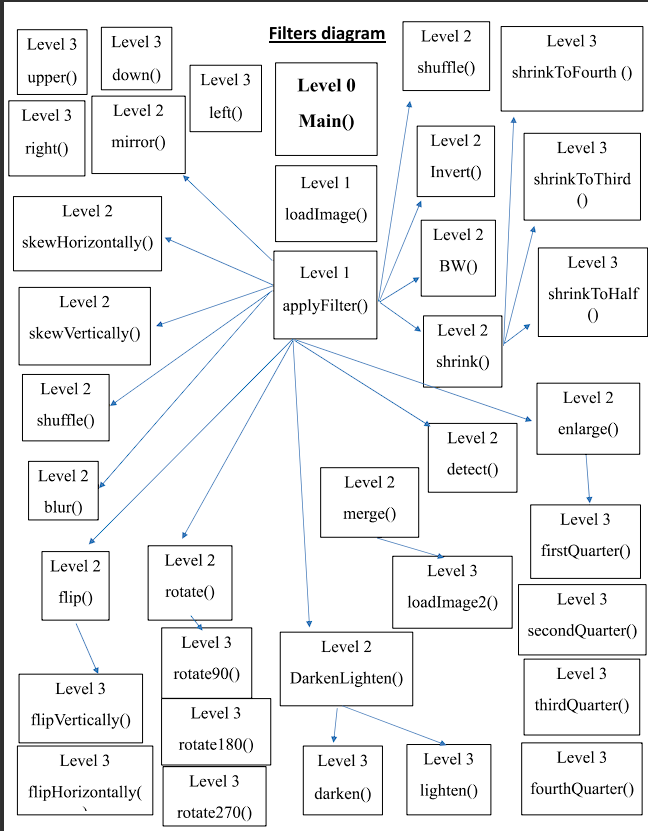

# Gray Scale Image Processor

An image processing software designed for manipulating grayscale and RGB images with various filters and operations.

## Description

This project provides functionality similar to photo editing software, allowing users to load images, apply filters, and save modified versions. Filters include operations like converting to black and white, inverting colors, merging images, flipping, rotating, adjusting brightness, detecting edges, enlarging, shrinking, mirroring, shuffling, blurring, cropping, and skewing.

### Filters Overview

1. **Black and White Image:** Converts the image to black and white based on average gray level.
2. **Invert Image:** Produces the negative of the image.
3. **Merge Images:** Creates a new image by averaging pixel values of two images.
4. **Flip Image:** Flips the image horizontally or vertically.
5. **Rotate Image:** Rotates the image by 90º, 180º, or 270º.
6. **Darken and Lighten Image:** Adjusts brightness of the image.
7. **Detect Image Edges:** Converts the image to a sketch-like version highlighting edges.
8. **Enlarge Image:** Enlarges one quarter of the image into a new image.
9. **Shrink Image:** Reduces image dimensions by factors of 2, 3, or 4.
10. **Mirror Image:** Mirrors sections of the image.
11. **Shuffle Image:** Rearranges quarters of the image based on user input.
12. **Blur Image:** Applies a blur effect to the image.
13. **Crop Image:** Crops a square section of the image.
14. **Skew Horizontally / Vertically:** Skews the image to the right or up.

## Files

- `cmake-build-debug/`: Build directory.
- `images/`: Folder containing test images.
- `bmplib.cpp`, `bmplib.h`: Library for loading image pixels into arrays.
- `GrayImages.cpp`: Program for filters on grayscale images.
- `RGBImages.cpp`: Program for filters on RGB images.
- `filtersDiagram.png`: Diagram showing each filter and their functions.

## Coding Style

The project follows proper C++ coding standards, ensuring readability and maintainability.

## Usage

To use the software, compile and run either `GrayImages.cpp` for grayscale images or `RGBImages.cpp` for RGB images. Ensure the necessary libraries and dependencies are installed.

## Contributions

Contributions are welcome! If you want to contribute to this project, please fork the repository and submit a pull request.
